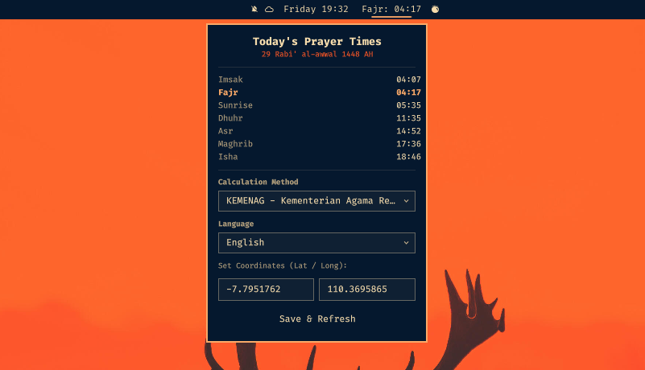

# 🕌 Prayer Time — born2ngopi.prayertime

Islamic prayer times widget for the [Omarchy](https://github.com/anomalyco/omarchy) bar.
Shows the **next prayer on the bar** (`Maghrib: 17:51`), opens a centered panel with the
full daily schedule + Hijri date, lets you pick a calculation method and location, and
sends a desktop notification when prayer time arrives.

## Screenshots



*Panel popup — today's schedule, Hijri date, calculation method & language dropdowns, coordinates.*


*Bar widget — shows the next prayer and its time.*

## Features

- **Bar widget** — always shows the *next* prayer and its time (skips Imsak/Sunrise).
- **Panel popup** — full schedule for today, Hijri date, the next prayer highlighted.
- **Calculation method dropdown** — 23 methods (strings displayed, integer values stored).
  Default: `20` (KEMENAG, Indonesia).
- **Custom coordinates** — type your Lat/Long in the panel and hit *Save & Refresh*
  (Enter also submits). Great for users outside Indonesia.
- **Desktop notifications** — fires within the 5 minutes before each prayer
  (deduplicated per prayer).
- **Multi-language UI** — English, Bahasa Indonesia, and العربية (RTL). Prayer names,
  panel labels, hijri date, and notifications all translate live.
- **Persistent settings** — your method, coordinates and language survive shell reloads
  (see [Configuration](#configuration)).
- **Right-click the bar widget** to force-refresh the schedule.

## Install

Install directly from GitHub:

```bash
omarchy plugin add https://github.com/born2ngopi/prayertime.git --enable
omarchy restart shell
```

This clones the plugin to `~/.config/omarchy/plugins/` and enables it.
The plugin registers under the id **`born2ngopi.prayertime`** (shown in `omarchy plugin list`).

> Requires a **network connection** — times are fetched from the
> [Aladhan Prayer Times API](https://aladhan.com/prayer-times-api).

### Enable / Disable

```bash
# enable and place in a specific section of the bar
omarchy plugin enable born2ngopi.prayertime --section right
omarchy plugin enable born2ngopi.prayertime --section center

# move an already-enabled plugin to a different section
omarchy bar move born2ngopi.prayertime --section center

# disable without removing files
omarchy plugin disable born2ngopi.prayertime

omarchy restart shell
```

### Uninstall

```bash
omarchy plugin remove born2ngopi.prayertime --yes
omarchy restart shell

# remove persisted settings (optional)
rm ~/.local/state/omarchy/prayertime.json
```

## Usage

| Action | Result |
| --- | --- |
| Left-click bar widget | opens the centered panel |
| Right-click bar widget | re-fetches today's times |
| Panel → *Calculation Method* | pick your authority; times refresh instantly |
| Panel → *Language* | switch UI between English / Bahasa Indonesia / العربية |
| Panel → *Save & Refresh* | apply new Lat/Long (Enter also works) |

## Configuration

Settings are persisted to **`~/.local/state/omarchy/prayertime.json`** (created
automatically on first run):

```json
{
  "settings": {
    "latitude": "-6.2088",
    "longitude": "106.8456",
    "calcMethod": 20,
    "language": "id"
  }
}
```

The file is watched — you can edit it live while the shell runs, or just use the
panel UI. Everything survives a shell restart.

### Getting your coordinates from Google Maps

Open your location in Google Maps, then copy the URL from the address bar. It looks like:

```
https://www.google.com/maps/place/Tugu+Yogyakarta+Monument/@-7.7951762,110.3695865,14z/data=...
```

Find the part right after `@` — it is `lat,lng,zoom`:

- **`-7.7951762`** → Latitude
- **`110.3695865`** → Longitude
- `14z` → zoom level (ignore it)

So for Tugu Yogyakarta: `latitude: -7.7951762`, `longitude: 110.3695865`.

Type those two numbers into the *Lat / Long* fields in the panel and hit
**Save & Refresh** (or just edit `~/.local/state/omarchy/prayertime.json`).

> Tip: URLs ending in `/data=!4m6...!3d<lat>!4d<lng>` also carry the exact pin
> coordinates (the `!3d...!4d...` pair) — that's Google's precise place marker,
> while the `@lat,lng` coordinates are the map-view center and are fine for
> prayer-time calculations either way.

### Language

Available languages: `en`, `id`, `ar`. If no language is set, it defaults to the
system locale when supported, otherwise English. Translations live in the
[`i18n/`](i18n/) folder as JSON key-maps (keys like `panel.title`, `prayer.Fajr`,
`notify.body`); the active file is reloaded and applied live when you switch
language, with English always used as a fallback for missing keys.

### Calculation methods

| Method | Name |
| --- | --- |
| 0 | Jafari / Shia Ithna-Ashari |
| 1 | University of Islamic Sciences, Karachi |
| 2 | Islamic Society of North America |
| 3 | Muslim World League |
| 4 | Umm Al-Qura University, Makkah |
| 5 | Egyptian General Authority of Survey |
| 7 | Institute of Geophysics, University of Tehran |
| 8 | Gulf Region |
| 9 | Kuwait |
| 10 | Qatar |
| 11 | Majlis Ugama Islam Singapura, Singapore |
| 12 | Union Organization islamic de France |
| 13 | Diyanet İşleri Başkanlığı, Turkey |
| 14 | Spiritual Administration of Muslims of Russia |
| 15 | Moonsighting Committee Worldwide |
| 16 | Dubai (experimental) |
| 17 | Jabatan Kemajuan Islam Malaysia (JAKIM) |
| 18 | Tunisia |
| 19 | Algeria |
| 20 | KEMENAG - Kementerian Agama Republik Indonesia |
| 21 | Morocco |
| 22 | Comunidade Islamica de Lisboa |
| 23 | Ministry of Awqaf, Islamic Affairs and Holy Places, Jordan |

## File structure

```
born2ngopi.prayertime/
├── manifest.json     # registry: bar-widget + overlay + service entry points
├── Service.qml       # API fetch, next-prayer logic, notifications, i18n, persistence
├── Panel.qml         # bar widget (qs.Ui.BarWidget) — shows "Next: HH:MM"
├── Popup.qml         # centered panel: schedule, method + language dropdowns, coordinates
├── Notification.qml  # overlay shown on summon (qs.Ui overlay contract)
├── docs/
│   ├── menu.png      # panel popup screenshot
│   └── bar.png       # bar widget screenshot
└── i18n/
    ├── en.json       # English translations (fallback)
    ├── id.json       # Bahasa Indonesia translations
    └── ar.json       # العربية translations
```

## Troubleshooting

After editing QML files, hot-reload may keep stale compiled code. Fix:

```bash
rm -rf ~/.cache/quickshell/qmlcache ~/.cache/quickshell/qtpipelinecache-*
omarchy restart shell
```

Watch the logs for errors:

```bash
journalctl --user -u omarchy-shell -f
```

## Credits

- Prayer times data: [Aladhan API](https://aladhan.com/prayer-times-api)
- Follows the Omarchy shell/panel/overlay contracts (`qs.Ui.*` components).